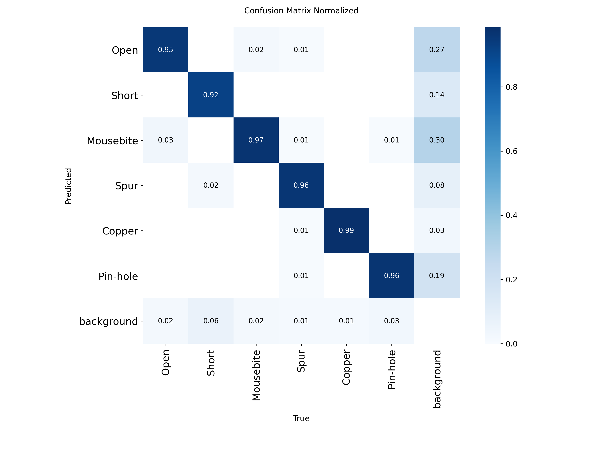

# PCB Defect Auditor

An automated optical inspection API for printed circuit boards. A YOLOv8 model, exported to ONNX and served through FastAPI, detects and classifies PCB defects and logs every inspection to a Postgres database (Neon) for later analysis.

Built as a self-directed project to go beyond model training into the full lifecycle: data, training, serving, storage, and (in progress) deployment.

---

## System Architecture

```
PCB Image Upload
      │
      ▼
FastAPI /inspect endpoint
      │
      ▼
OpenCV preprocessing (resize, normalize, transpose)
      │
      ▼
ONNX Runtime inference (YOLOv8, CPU)
      │
      ▼
NMS + confidence filtering → defect_type, confidence
      │
      ▼
Neon Postgres — inspections table
```

- **Inference:** YOLOv8n, fine-tuned on DeepPCB, exported to ONNX (11.7MB) so the API doesn't need a full PyTorch runtime to serve predictions.
- **Backend:** FastAPI with SQLAlchemy ORM, async endpoints.
- **Storage:** Neon (serverless Postgres) — chosen specifically to sidestep local Docker setup issues during development, and it turned out to be a genuinely good fit for a small project like this.

---
## Core Engineering & Security Decisions
1. Deep Payload Validation (Zero-Trust Decoding)
Trusting client-provided HTTP headers (such as content-type: image/jpeg) presents a critical security vulnerability. This architecture enforces a physical decode of the raw byte stream using cv2.imdecode at the processing layer. If a malicious script or corrupted byte array is injected, it fails mathematical tensor conversion and is explicitly rejected before interacting with the ONNX inference engine.

2. GUI-Less Containerization
The deployment environment is stripped of all OS-level display dependencies (e.g., libgl1). By leveraging opencv-python-headless, the Docker image footprint is drastically reduced, mitigating supply-chain vulnerabilities and ensuring the container remains strictly optimized for backend server operations.

3. Environment-Aware Simulation Mode
To maintain a robust CI/CD pipeline without exposing proprietary .onnx model weights to cloud runners, the ML engine features a deterministic fallback execution path. If raw weights are absent, the system boots into Simulation Mode, maintaining strict payload validation and standardizing JSON responses to guarantee accurate end-to-end integration testing.

## Defect classes

The model detects six PCB fabrication defects, trained on the DeepPCB dataset:

1. **Open** — broken copper trace, causing an open circuit
2. **Short** — unintended bridge between adjacent conductive paths
3. **Mousebite** — small cutouts or jagged edges along a trace
4. **Spur** — unwanted copper protrusion off a trace
5. **Copper** — residual, unetched copper flakes
6. **Pin-hole** — voids in a conductive pad or trace

---

## Evaluation

Trained YOLOv8n for 99 epochs on DeepPCB (early-stopped from a 100-epoch budget, patience=20, best weights from epoch 79). Full training run: `notebooks/train_pcb_model.ipynb`.

**Overall (validation set, 150 images, 984 instances):**

| Metric | Value |
|---|---|
| Precision | 0.974 |
| Recall | 0.952 |
| mAP50 | 0.979 |
| mAP50-95 | 0.791 |

**Per class:**

| Class | mAP50 | mAP50-95 |
|---|---|---|
| Open | 0.988 | 0.731 |
| Short | 0.948 | 0.703 |
| Mousebite | 0.976 | 0.769 |
| Spur | 0.976 | 0.751 |
| Copper | 0.995 | 0.911 |
| Pin-hole | 0.989 | 0.879 |

Full numbers and raw per-epoch log: `docs/training_results/metrics.md` and `results.csv`.

### Confusion matrix



The diagonal is strong across every class (0.92–0.99), which is the main signal — the model isn't confusing defect types with each other. The real weak spot is the **background column**: Mousebite (0.30) and Open (0.27) are the two classes most often triggered by substrate edges or normal board texture that isn't actually a defect. That's a background-vs-defect problem, not a defect-vs-defect problem, and it's the honest limitation worth calling out rather than glossing over.

**What I haven't measured yet, and won't claim until I have:** real inference latency under load, and any comparison against published DeepPCB baselines. Both are on the roadmap below rather than stated here as numbers I can't currently reproduce.

---

## Project structure

```
pcb-defect-auditor/
├── app/
│   ├── api/             # API route definitions
│   ├── core/            # Config, database connections, environment settings
│   ├── db/              # SQLAlchemy schema models
│   ├── ml/              # ONNX runtime inference session & NMS logic
│   └── main.py          # FastAPI application entrypoint
├── docs/
│   └── training_results/# Confusion matrix, PR curves, and training metrics
├── models/
│   └── pcb_defect_v1.onnx        # Exported YOLOv8 production model weights
├── scripts/
│   └── convert_labels.py# Annotation parser for DeepPCB coordinate mappings
├── requirements.txt
└── README.md
```

---

## A note on the dataset

Getting to a working model took two failed attempts before this one worked, and I'm leaving that in rather than pretending it was smooth:

First attempt used a Roboflow-hosted export of PKU-Market-PCB. The data.yaml class names had somehow been replaced with Roboflow's own boilerplate text instead of real defect labels.

Second attempt with DeepPCB initially failed with "no labels found" — the raw download didn't include YOLO-format annotations at all.

Third attempt, using a properly YOLO-formatted DeepPCB export, is the one that actually worked.

scripts/convert_labels.py documents the fix for the label formatting.

## CI/CD Pipeline
Continuous Integration is enforced via GitHub Actions on Ubuntu runners:

1.Environment Provisioning: Installs Python 3.12 and GUI-less dependencies.

2.Automated Testing: Executes the pytest suite against a mocked SQLite memory database.

3.Container Build Verification: Compiles the Dockerfile to validate Debian OS compatibility and image integrity prior to production deployment.
---

## Running it locally

```bash
git clone https://github.com/AarushiSharma1515/pcb-defect-auditor.git
cd pcb-defect-auditor

python -m venv .venv
.venv\Scripts\activate        # Windows
# source .venv/bin/activate   # Linux/macOS

pip install -r requirements.txt
```

Create a `.env` file in the root:
```env
DATABASE_URL=postgresql://<user>:<password>@<neon-host>/<dbname>?sslmode=require
MODEL_PATH=models/pcb_defect_v1.onnx
```

Run it:
```bash
uvicorn app.main:app --reload
```
Then open `http://127.0.0.1:8000/docs` for the interactive API.

---

## API

**`GET /`** — health check
```json
{"status": "PCB Defect Auditor is running"}
```

**`GET /inspections`** — list all logged inspections

**`POST /inspect`** — run an inspection
- Form fields: `board_id` (string), `file` (image)
- Response:
```json
{
  "status": "success",
  "board_id": "PANEL-004",
  "telemetry": {
    "defect_type": "Copper",
    "confidence": 0.9142,
    "processing_ms": 48
  }
}
```

---
## Tech stack

Python · FastAPI · SQLAlchemy · PostgreSQL (Neon) · YOLOv8 · ONNX Runtime · OpenCV · pytest · Docker # PCB Defect Auditor

